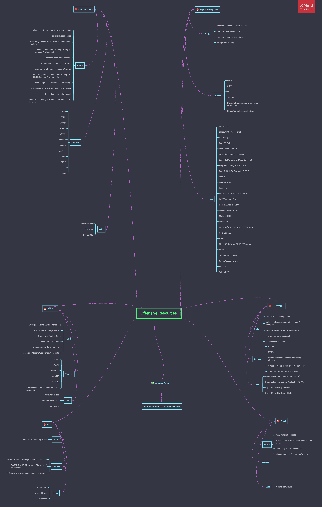

# Offensive-Resources
A Huge Learning Resources For Offensive Security Players 

 
 

# Mind Map

 
 
 

# Content
  - <a href="#infrastructure">Infrastructure</a>
  - <a href="#exploit-development">Exploit Development</a>
  - <a href="#web-applications">Web Applications</a>
  - <a href="#mobile-applications">Mobile Applications</a>
  - <a href="#api">API</a>
  - <a href="#cloud">Cloud</a>
  
 
 
 

# Infrastructure 

- Books
  - <a href="https://www.amazon.com/Advanced-Infrastructure-Penetration-Testing-methodized-ebook/dp/B076QC8FRT">Advanced Infrastructure  Penetration testing</a>
  - <a href="https://www.amazon.com/Peter-Kim/e/B00J12259C/ref=dp_byline_cont_book_1">Hacker playbook series</a>
  - <a href="https://www.amazon.com/Attacking-Network-Protocols-Analysis-Exploitation/dp/1593277504">Attacking Network Protocols</a>
  - <a href="https://www.amazon.com/Mastering-Linux-Advanced-Penetration-Testing/dp/178934056X/">Mastering Kali Linux for Advanced Penetration Testing </a>
  - <a href="https://www.amazon.com/Advanced-Penetration-Testing-Highly-Secured-Environments-ebook/dp/B01A14X6LE/">Advanced Penetration Testing for Highly-Secured Environments</a>
  - <a href="https://www.amazon.com/Advanced-Penetration-Testing-Hacking-Networks/dp/1119367689/">Advanced Penetration Testing </a>
  - <a href="https://www.amazon.com/IoT-Penetration-Testing-Cookbook-vulnerabilities/dp/1787280578/">IoT Penetration Testing Cookbook</a>
  - <a href="https://www.amazon.com/Hands-Penetration-Testing-Windows-PowerShell/dp/1788295668/">Hands-On Penetration Testing on Windows</a>
  - <a href="https://www.amazon.com/Mastering-Wireless-Penetration-Testing-Environments-ebook/dp/B00T4ACP78/">Mastering Wireless Penetration Testing for Highly Secured Environments</a>
  - <a href="https://www.amazon.com/Mastering-Kali-Linux-Wireless-Pentesting-ebook/dp/B015RHQ0OU/">Mastering Kali Linux Wireless Pentesting </a>
  - <a href="https://www.amazon.com/Cybersecurity-state-art-organization-cybercriminals/dp/183882779X/">Cybersecurity - Attack and Defense Strategies</a>
  - <a href="https://www.amazon.com/Rtfm-Red-Team-Field-Manual/dp/1494295504/">RTFM: Red Team Field Manual</a>
  - <a href="https://www.amazon.com/Penetration-Testing-Hands-Introduction-Hacking/dp/1593275641/">Penetration Testing: A Hands-on Introduction to Hacking</a>
  
- Courses
  - <a href="https://www.offensive-security.com/pwk-oscp/">OSCP</a>
  - <a href="https://www.offensive-security.com/pen300-osep/">OSEP</a>
  - <a href="https://www.offensive-security.com/wifu-oswp/">OSWP</a>
  - <a href="https://my.ine.com/CyberSecurity/learning-paths/9a29e89e-1327-4fe8-a201-031780263fa9/penetration-testing-professional">eCPPT</a>
  - <a href="https://my.ine.com/CyberSecurity/learning-paths/154876ad-ae9f-43d6-add4-f635cab537a7/advanced-penetration-testing">eCPTX</a>
  - <a href="https://www.sans.org/cyber-security-courses/network-penetration-testing-ethical-hacking/">SEC560</a>
  - <a href="https://www.sans.org/cyber-security-courses/advanced-penetration-testing-exploits-ethical-hacking/">SEC660</a>
  - <a href="https://www.sans.org/cyber-security-courses/red-team-exercises-adversary-emulation/">SEC564</a>
  - <a href="https://www.pentesteracademy.com/activedirectorylab">CRTP</a>
  - <a href="https://www.pentesteracademy.com/redteamlab">CRTE</a>
  - <a href="https://www.mile2.com/professional-ethical-hacker/">CPEH</a>
  - <a href="https://www.mile2.com/penetration-testing-engineer-outline/">CPTE</a>
  
- Labs
  - <a href="https://www.hackthebox.eu/">Hack The Box</a>
  - <a href="https://www.vulnhub.com/">Vulnhub</a>
  - <a href="https://www.offensive-security.com/labs/individual/">Offensive Security Proving Grounds</a>
  - <a href="https://tryhackme.com">TryHackMe</a>
  
 
 

# Exploit Development
  - Books
    - <a href="https://www.amazon.com/Penetration-Testing-Shellcode-network-level-vulnerabilities-ebook/dp/B076H9DD9N">Penetration Testing with Shellcode</a>
    - <a href="https://www.amazon.com/Shellcoders-Handbook-Discovering-Exploiting-Security-ebook/dp/B004P5O38Q/">The Shellcoder's Handbook</a>
    - <a href="https://www.amazon.com/Hacking-Art-Exploitation-Jon-Erickson-ebook/dp/B004OEJN3I/">Hacking: The Art of Exploitation</a>
    - <a href="https://www.amazon.com/Bug-Hunters-Diary-Software-Security/dp/1593273851/">A Bug Hunter's Diary</a>
  
  - Courses
    - <a href="https://www.offensive-security.com/ctp-osce/">OSCE</a>
    - <a href="https://www.offensive-security.com/awe-osee/">OSEE</a>
    - <a href="https://my.ine.com/path/019938d9-11cf-459b-b8ee-e662e10515f2">eCXD</a>
    - <a href="https://www.sans.org/cyber-security-courses/advanced-exploit-development-penetration-testers/">SEC760</a>
    - <a href="https://github.com/cranelab/exploit-development">Exploit-Development Repo</a>
    - <a href="https://guyinatuxedo.github.io/">Nightmare</a>
    - <a href="https://www.pentesteracademy.com/course?id=3">x86 Assembly Language and Shellcoding on Linux</a>
    - <a href="https://www.pentesteracademy.com/course?id=7">x86_64 Assembly Language and Shellcoding on Linux</a>
    - <a href="https://www.pentesteracademy.com/course?id=41">Reverse Engineering Win32 Applications</a>
    - <a href="https://www.pentesteracademy.com/course?id=40">Reverse Engineering Linux 32-bit Applications</a>
    - <a href="https://www.pentesteracademy.com/course?id=13">Exploiting Simple Buffer Overflows on Win32</a>
    
  - Labs
    - <a href="https://github.com/stephenbradshaw/vulnserver">Vulnserver</a>
    - <a href="">BlazeDVD 5 Professional</a>
    - <a href="">DVDx Player</a>
    - <a href="">Easy CD DVD</a>
    - <a href="">Easy Chat Server 3.1</a>
    - <a href="">Easy File Sharing FTP Server 3.5</a>
    - <a href="">Easy File Management Web Server 5.3</a>
    - <a href="">Easy File Sharing Web Server 7.2</a>
    - <a href="">Easy RM to MP3 Converter 2.7.3.7</a>
    - <a href="">Eureka</a>
    - <a href="">FreeFTP 1.0.8 </a>
    - <a href="">FreeFloat</a>
    - <a href="">KarjaSoft Sami FTP Server 2.0.1</a>
    - <a href="">KnFTP Server 1.0.0</a>
    - <a href="">Kolibri v2.0 HTTP Server</a>
    - <a href="">Millenium MP3 Studio</a>
    - <a href="">Minialic HTTP</a>
    - <a href="">Minishare</a>
    - <a href="">ProSysInfo TFTP Server TFTPDWIN 0.4.2</a>
    - <a href="">QuickZip 4.60</a>
    - <a href="">R v3.4.4</a>
    - <a href="">Ricoh DC Software DL-10 FTP Server</a>
    - <a href="">SolarFTP</a>
    - <a href="">Soritong MP3 Player 1.0 </a>
    - <a href="">Xitami Webserver 2.5</a>
    - <a href="https://www.vulnhub.com/">Vulnhub</a>
    - <a href="https://www.hackthebox.eu/">Hack the box</a>

 
 

# Web Applications
  - Books
    - <a href="https://www.amazon.com/Web-Application-Hackers-Handbook-Exploiting/dp/1118026470/">Web application's hackers handbook</a>
    - <a href="https://portswigger.net/web-security/all-materials">Portswigger learning materials</a>
    - <a href="https://owasp.org/www-project-web-security-testing-guide/v42/">Owasp web Testing Guide</a>
    - <a href="https://www.amazon.com/Real-World-Bug-Hunting-Field-Hacking/dp/1593278616">Real World Bug Hunting</a>
    - <a href="https://payhip.com/ghostlulz">Bug Bounty playbook part 1 & 2</a>
    - <a href="https://www.amazon.com/Mastering-Modern-Web-Penetration-Testing/dp/1785284584">Mastering Modern Web Penetration Testing</a>
    
  - Courses
    - <a href="https://www.offensive-security.com/awae-oswe/">OSWE</a>
    - <a href="https://my.ine.com/CyberSecurity/learning-paths/50d07b7c-1224-4bda-a57b-3954e189bfc1/web-application-penetration-tester-professional">eWAPT</a>
    - <a href="https://my.ine.com/CyberSecurity/learning-paths/7d3a5df8-a6cf-4855-b686-30e9d7e76425/advanced-web-application-penetration-testing">eWAPTX</a>
    - <a href="https://www.sans.org/cyber-security-courses/web-app-penetration-testing-ethical-hacking/">SEC542</a>
    - <a href="https://www.sans.org/cyber-security-courses/advanced-web-app-penetration-testing-ethical-hacking/">SEC642</a>
    - <a href="https://hackersera.com/p/?page=online-training">Offensive bug bounty hunter part 1 &2 hackersera</a>
    
  - Labs
    - <a href="https://portswigger.net/web-security/all-labs">Portswigger labs</a>
    - <a href="https://owasp.org/www-project-juice-shop/">OWASP Juice shop</a>
    - <a href="https://owasp.org/www-project-broken-web-applications/migrated_content">Owasp Broken Web Apps </a>
    - <a href="https://pentesterlab.com/">Pentesterlab</a>
    - <a href="https://www.root-me.org/">root-me</a>

 
 

# Mobile Applications
  - Books
    - <a href="https://owasp.org/www-project-mobile-security-testing-guide/">OWASP Mobile Security Testing Guide</a>
    - <a href="https://www.amazon.com/Mobile-Application-Penetration-Testing-Vijay-ebook/dp/B019IOX4Y2/">Mobile application penetration testing</a>
    - <a href="https://www.amazon.com/Mobile-Application-Hackers-Handbook/dp/1118958500/">Mobile applicatons hacker's handbook</a>
    - <a href="https://www.amazon.com/Android-Hackers-Handbook-Joshua-Drake/dp/111860864X/">Android hacker's handbook/</a>
    - <a href="https://www.amazon.com/iOS-Hackers-Handbook-Charlie-Miller/dp/1118204123/">iOS Hacker's Handbook</a>
    
  - Courses
    - <a href="https://my.ine.com/CyberSecurity/learning-paths/eec5479e-a8d1-4803-817f-c016bb528639/mobile-application-penetration-testing-professional">eMAPT</a>
    - <a href="https://www.sans.org/cyber-security-courses/mobile-device-security-ethical-hacking/">SEC575</a>
    - <a href="https://hackersera.com/p/?page=online-training">Offensive AndroHunter</a>
    - <a href="https://www.udemy.com/course/bug-bounty-hunting-practical-android-penetration-testing/">ANDROID Hacking & Penetration Testing</a>
    - <a href="https://www.udemy.com/course/hacking-and-pentesting-ios-applications/">Hacking and Pentesting iOS Applications </a>
    
  - Labs
    - <a href="http://damnvulnerableiosapp.com/">Damn Vulnerable iOS Application (DVIA)</a>
    - <a href="https://pentester.land/cheatsheets/2018/10/12/list-of-Intentionally-vulnerable-android-apps.html">List of intentionally vulnerable Android apps</a>
    - <a href="https://securitycompass.github.io/iPhoneLabs/">ExploitMe Mobile iPhone Labs </a>
    - <a href="https://securitycompass.github.io/AndroidLabs/">ExploitMe Mobile Android Labs </a>

 
 

# API
  - Books
    - <a href="https://owasp.org/www-project-api-security/">OWASP API Security Project</a>
    
  - Courses
    - <a href="https://hackerassociate.com/training-and-certification/oaes-offensive-api-exploitation-and-security-training/">OAES Offensive API Exploitation and Security</a>
    - <a href="https://www.pluralsight.com/courses/owasp-top-ten-api-security-playbook">OWASP Top 10: API Security Playbook</a>
    - <a href="https://ar-ar.facebook.com/officialhackersera/posts/1387454408290281?__tn__=-R">Offensive Api  penetration testing</a>

  - Labs
    - <a href="https://github.com/payatu/Tiredful-API">Tiredful API</a>
    - <a href="https://github.com/rahulunair/vulnerable-api">vulnerable-api</a>
    - <a href="https://github.com/marmicode/websheep">websheep</a>

 
 

# Cloud
  - Books
    - <a href="https://www.amazon.com/AWS-Penetration-Testing-Beginners-Metasploit/dp/1839216921/">AWS Penetration Testing </a>
    - <a href="https://www.amazon.com/Hands-Penetration-Testing-Kali-Linux/dp/1789136725/">Hands-On AWS Penetration Testing with Kali Linux</a>
    - <a href="https://www.amazon.com/Pentesting-Azure-Applications-Definitive-Deployments/dp/1593278632/">Pentesting Azure Applications</a>
    - <a href="https://www.amazon.com/Mastering-Cloud-Penetration-Testing-Sehgal/dp/1786461234/">Mastering Cloud Penetration Testing</a>
  
  - Courses
    - <a href="https://www.sans.org/cyber-security-courses/cloud-penetration-testing/">SEC588</a>
  
  - Labs
    - Create Your own lab from the books
    
 
 

# Created By
<a href="https://www.linkedin.com/in/zer0verflow/">Zeyad Azima</a>
